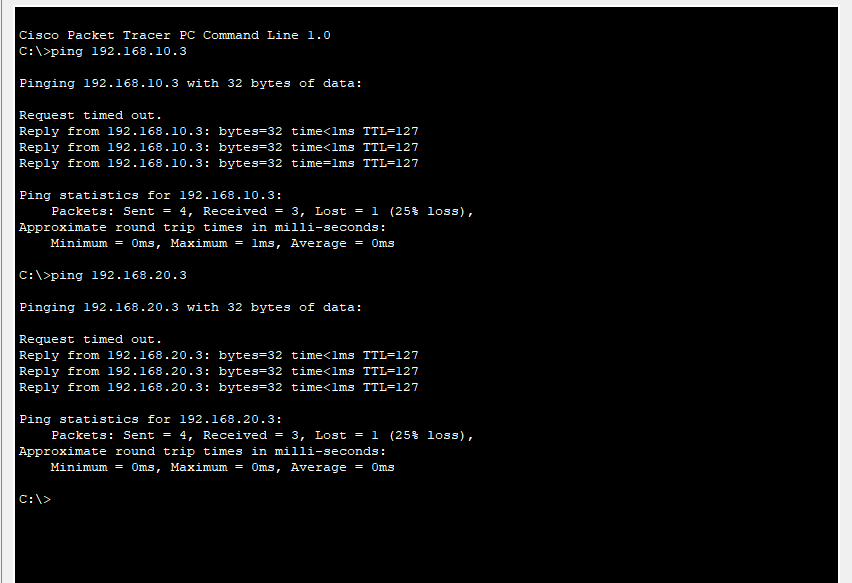

# Inter-VLAN Routing in Cisco Packet Tracer

## 📌 Project Overview
This project demonstrates how to configure **Inter-VLAN Routing** using a Cisco 2811 Router and a Catalyst 2960 Switch in **Cisco Packet Tracer**.  
The network is designed for a small office environment with **three departments** (HR, IT, and Finance). Each department has its own VLAN and subnet, and the router provides communication between these VLANs using **Router-on-a-Stick** configuration.

---

## 🎯 Objectives
- Design a departmental office network with multiple VLANs.  
- Configure VLANs on a Layer 2 switch.  
- Implement **Inter-VLAN Routing** using sub-interfaces on the router.  
- Assign IP addresses and default gateways for each PC.  
- Test cross-department communication with `ping`.

---

## Network Topology
- **Departments (VLANs & Subnets):**
  - HR (VLAN 10) → `192.168.10.0/24`
  - IT (VLAN 20) → `192.168.20.0/24`
  - Finance (VLAN 30) → `192.168.30.0/24`

- **Devices:**
  - Cisco **2960 Switch**  
  - Cisco **2811 Router**  
  - 6 PCs (2 per department)

- **Connections:**
  - Switch port `fa0/24` → Router port `fa0/0` (Trunk link)  
  - PCs connected to switch access ports

---

## ⚙️ Configuration Steps

### 1️⃣ VLAN Creation on Switch
```bash
Switch> enable
Switch# configure terminal
Switch(config)# vlan 10
Switch(config-vlan)# name HR
Switch(config-vlan)# exit
Switch(config)# vlan 20
Switch(config-vlan)# name IT
Switch(config-vlan)# exit
Switch(config)# vlan 30
Switch(config-vlan)# name FINANCE
Switch(config-vlan)# exit
```
### 2️⃣ Assign VLANs to Ports
```bash
Copy code
Switch(config)# interface fa0/1
Switch(config-if)# switchport mode access
Switch(config-if)# switchport access vlan 10
Switch(config-if)# exit

Switch(config)# interface fa0/2
Switch(config-if)# switchport mode access
Switch(config-if)# switchport access vlan 10
Switch(config-if)# exit
(Similarly assign VLAN 20 for fa0/3–4, VLAN 30 for fa0/5–6)
```
### 3️⃣ Configure Trunk Port
```bash
Switch(config)# interface fa0/24
Switch(config-if)# switchport mode trunk
Switch(config-if)# exit
```
### 4️⃣ Router Sub-Interfaces (Router-on-a-Stick)
```bash
Router> enable
Router# configure terminal
Router(config)# interface fa0/0.10
Router(config-subif)# encapsulation dot1Q 10
Router(config-subif)# ip address 192.168.10.1 255.255.255.0
Router(config-subif)# exit

Router(config)# interface fa0/0.20
Router(config-subif)# encapsulation dot1Q 20
Router(config-subif)# ip address 192.168.20.1 255.255.255.0
Router(config-subif)# exit

Router(config)# interface fa0/0.30
Router(config-subif)# encapsulation dot1Q 30
Router(config-subif)# ip address 192.168.30.1 255.255.255.0
Router(config-subif)# exit

Router(config)# interface fa0/0
Router(config-if)# no shutdown
```
---

### 5️⃣ Assign IPs to PCs
```bash
HR PC1 → 192.168.10.2 / 255.255.255.0 / GW 192.168.10.1

HR PC2 → 192.168.10.3 / 255.255.255.0 / GW 192.168.10.1

IT PC1 → 192.168.20.2 / 255.255.255.0 / GW 192.168.20.1

IT PC2 → 192.168.20.3 / 255.255.255.0 / GW 192.168.20.1

Finance PC1 → 192.168.30.2 / 255.255.255.0 / GW 192.168.30.1

Finance PC2 → 192.168.30.3 / 255.255.255.0 / GW 192.168.30.1
```
---
### ✅ Testing
Ping between HR → IT → Finance PCs.

Example:

- From HR PC1 (192.168.10.2) → Ping Finance PC1 (192.168.30.2).

- Successful reply confirms Inter-VLAN communication is working.

📸 Screenshots



### 🔑 Key Learnings
 - Importance of VLANs in segmenting networks.

- Role of trunk ports in carrying multiple VLAN traffic.

- How Router-on-a-Stick enables communication between VLANs.

- Subnetting and assigning gateways for proper routing.

### Future Improvements
- Add DHCP server for dynamic IP allocation.

- Configure ACLs to control inter-department access.

- Implement redundancy with multiple switches/routers.

